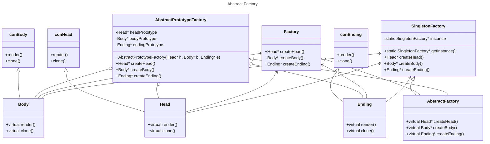

# Лабораторная работа № 6 #

## UML - диаграммы ##

## Цель работы ##

Осознать эти диаграммы хоть немного, а ото ведь позорник и не
разбираюсь совсем.

## Задания для выполнения ##

Задания как такового не было, поэтому
решил взять то, что выглядит сильно связанным
с этой темой, а именно лабораторная по паттернам.

В диаграмме описываются связи между классами
фабрик, частей, наследования....

Я пытался сделать dll с гугл тестами, но пусть я и создал
dll, я даже первую команду по установке гугл тестов
всеми правдами-неправдами выполнить не смог(((

Получил вот это:

D:\AUF3\OOP\task_06\proga>git submodule add
git@github.com:google/googletest.git

Cloning into 'D:/AUF3/OOP/task_06/proga/googletest'...
git@github.com: Permission denied (publickey).

fatal: Could not read from remote repository.

Please make sure you have the correct access rights
and the repository exists.

fatal: clone of 'git@github.com:google/googletest.git' into
submodule path 'D:/AUF3/OOP/task_06/proga/googletest' failed

Интернет тоже не помог. Можно было сделать тесты через MVS,
но там тоже не сильно сахар.

Жаль, что нет ЕГЭ по анекдотам про штирлица...

Диаграмма как есть, но Mermaid:

## Вывод ##

разобрался c UML и осознав, что всякая программа требует документации, принял mermaid.
